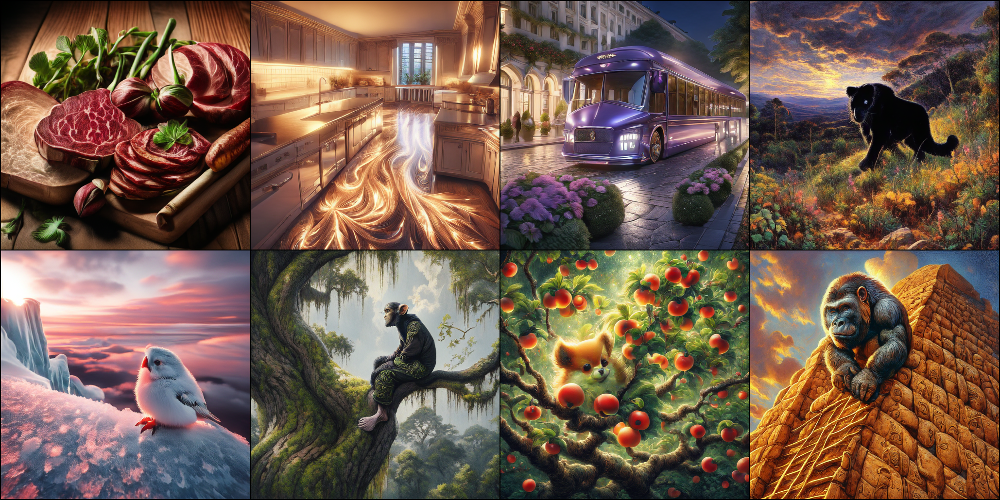

# 🚀 LongPrompt-LLamaGen

  
  
  
  
  
  

## 🌟 Introduction

LongPrompt-LLamaGen is a improved LLamaGen modell that combines long-text prompts with cutting-edge AI technology, providing unprecedented image generation capabilities for creatives and developers.

### 🔥 Key Features

- **High-Quality Training Data**: Fine-tuned on 500,000 high-quality images
- **Long Text Understanding**: Each image accompanied by 300+ token prompts
- **Intelligent Prompt Optimization**: Built-in prompt refining for enhanced output quality
- **Continuous Updates**: Our team constantly optimizes the model to stay ahead of the curve

## 🚀 How to Use 
'''python
1. Install the required packages following the instructions in the original LlamaGen repository.
2. Download the pre-trained model from [HuggingFace Link](https://huggingface.co/Owen777/LongPrompt-LLamaGen), the model size is about 3.11G.
3. Use the model to generate images by following the example code provided in the repository.
'''

### 🙏 Acknowledgements

We would like to express our gratitude to the LlamaGen team for their groundbreaking work: [Autoregressive Model Beats Diffusion: 🦙 Llama for Scalable Image Generation](https://github.com/FoundationVision/LlamaGen?tab=readme-ov-file). Their research has been instrumental in advancing the field of image generation using autoregressive models.

